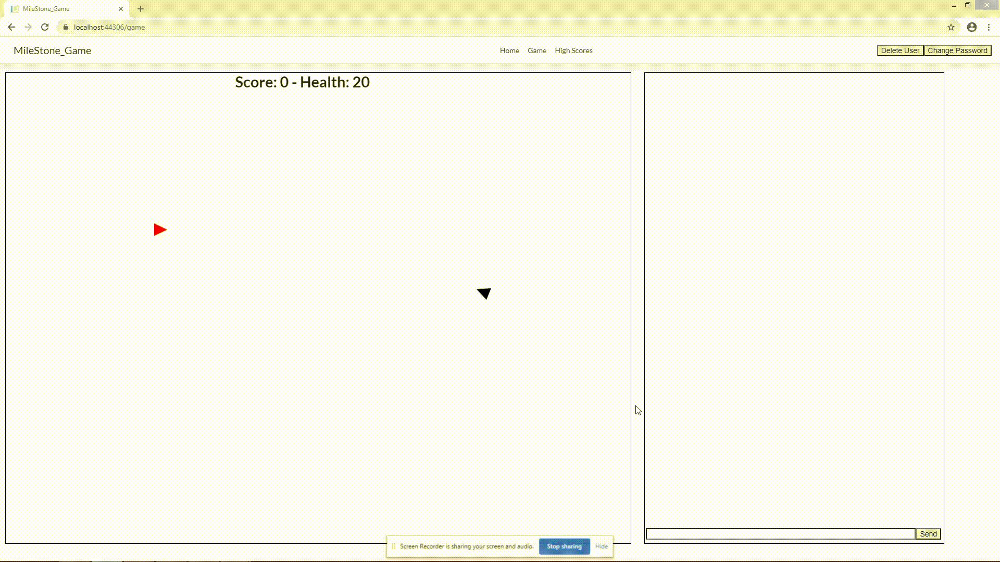

# MileStone
# Andrew Scott
# Make a game to have fun!
# The app is a game. And it's fun.

#Installation Instruction:  
git clone  
npm install semantic-ui-react --save  
npm install semantic-ui-css --save  
PM>Update-Database  

#Project Description:  
An asteroids-like dog-fighting real time multiplayer game. If you're testing it locally then you can open different tabs and see the realtime changes on all screens. There is a chat box to exclaim after your triumph!  

You can leave the playing field but BEWARE! "The outer box is the hard-deck for this hop!. There'll be no engagement below that."  

It is hosted on Azure @ https://milestone-game20200603214044.azurewebsites.net/. But it's not always running. If you have the need for speed, then that's where to play!  

#Notes
1. The load time is quite long.
2. Not sure if it's just for me, but if you're not 'focused' the page when it's loading it won't load..?
3. Sometimes the DB won't load before the modal does. You might hit enter without any validation errors but you still won't enter. Just wait 5-10 seconds and it should log you in once it connects. (Implemented last minute fix. It works remotely).
4. You can load multiple players by copying the link and pasting it in a new tab. 
5. It can lag badly when 3 or more players are present. 
6. It can sometimes overload your operating system. There could be some memory leaks. It shouldn't be too bad but it starts it's own HubService and that can run after the program is closed.
7. You have to be focused on the canvas to play. And focused on the chat to type.
8. If you want to play with others remotely, you have to switch the commented/uncommented lines out in Startup.cs. (Lines 16-17 swap, Lines 36-37 swap, Lines (79-80) swap with lines (84-88).  
9. The creds. for the Azure database are Username: Andrew Password:techCAREERS!
10. If you die, you have to reload the page to respawn. Your chat logs get erase :( (Sorry but that's FREE for ya').  
#Trello - https://trello.com/b/7dBjmoFc/milestone
I worked alone so I didn't attach members to all cards.
I also didn't use wireframes because there is no actual design or style.

#Testing
Home Page (Login Modal) only accepts Usernames with correct passwords or Unique usernames with passwords that include 3 chars. one digit and one letter (Changed from my original validation but it's all the same). No Blank fields.
Any of these criteria being broken will prompt visual alerts.

Test 1:  
Username: I4MUN1QU3  
Password:  
Results:  
Error: "Password cannot be blank"  

Test 2:  
Username: iMUn1Qu3  
Password: pass  
Error: "Password must be at least 3 characters, contain one letter, and one digit"  

There aren't many place for user input except for the canvas, which needs to be determinate; So resolving all exceptions and logic errors has been attempted.

## Resources Used ##
Chat.js - https://codingblast.com/asp-net-core-signalr-chat-react/ - It's exactly the same as the tutorial. But it's a trivial part of my site.  
GameHub.js - rotate() https://stackoverflow.com/questions/17410809/how-to-calculate-rotation-in-2d-in-javascript - Used this to calculate the rotation of the ships.

